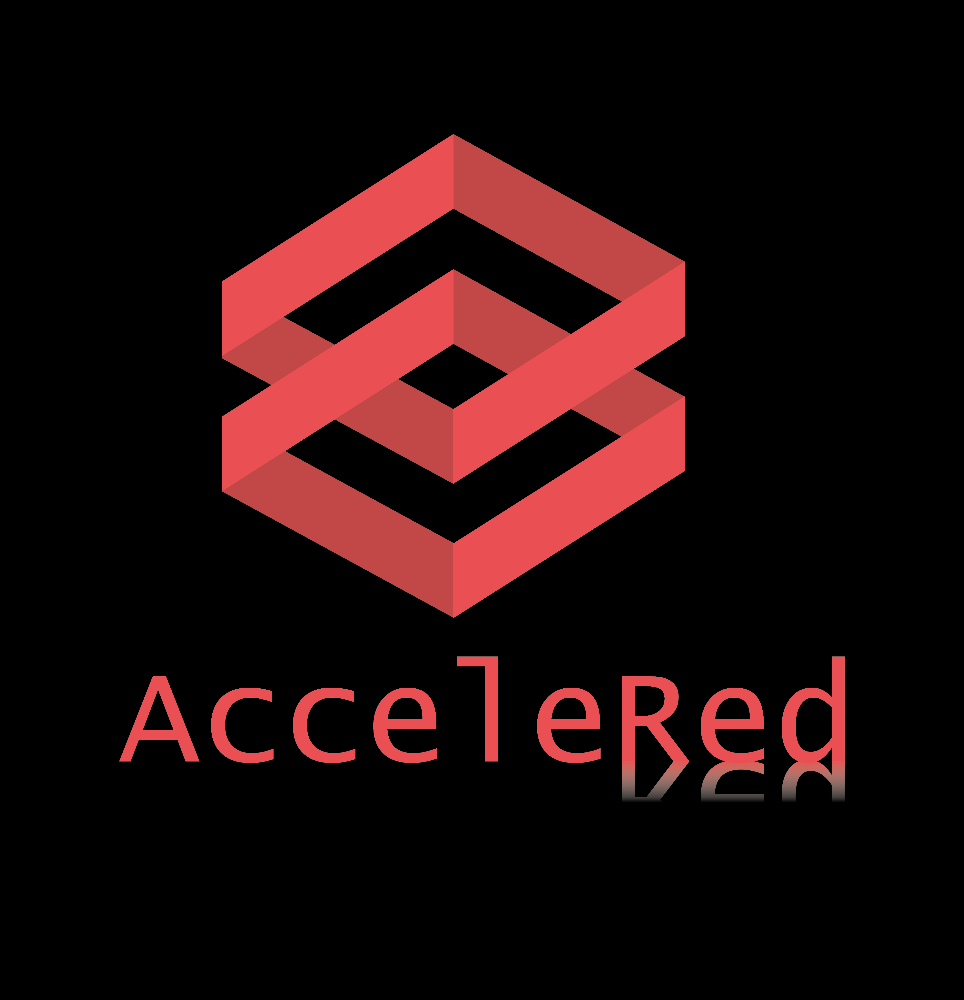

## Welcome to the best webpage ever

Hello, this is my changed text. **HELLO AGAIN!!!!**

# Hello Awesome People
## This is a test
### And another test

This is my new list
- Jesus
- Marjorie
- Kiliana
- Faby

1. Do not know what to write
2. still not

**Trying bold test** and normal text and _italic text is awesome too_ now back to normal and now `code whatever`.

**END OF MY TEST** :-)

[Link](url) and 

For more details see [GitHub Flavored Markdown](https://guides.github.com/features/mastering-markdown/).

### Jekyll Themes

Your Pages site will use the layout and styles from the Jekyll theme you have selected in your [repository settings](https://github.com/KarinKM/KarinKM.github.io/settings). The name of this theme is saved in the Jekyll `_config.yml` configuration file.

### Support or Contact

Having trouble with Pages? Check out our [documentation](https://docs.github.com/categories/github-pages-basics/) or [contact support](https://github.com/contact) and we’ll help you sort it out.
